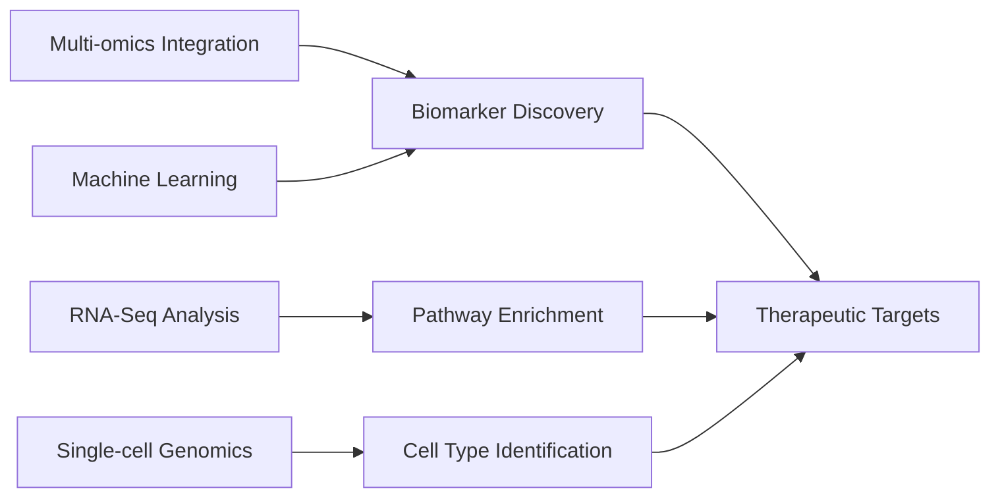

# Muteeba Azhar | Computational Biologist 👩‍🔬

---

## 🧬 Professional Profile

**Muteeba Azhar** is a dedicated Computational Biologist bridging the gap between complex biological systems and data-driven discovery. With expertise in high-throughput data analysis and pipeline development, she translates biological questions into quantitative solutions that advance genomics, transcriptomics, and systems biology research.

## 🛠️ Technical Stack

### **Programming & Analytics**

### **Bioinformatics Tools**

### **Data Science & ML**

### **Platforms & Infrastructure**

## 📊 Research Domains

> "Data is the new microscope. Code is the new assay. Together, they are revolutionizing how we understand life itself."

**Core Values:**
- 🔬 **Rigorous Analysis:** Ensuring statistical soundness in biological interpretation
- 📊 **Reproducibility:** Building transparent, documented workflows
- 🤝 **Collaboration:** Bridging computational and experimental domains
- 🚀 **Innovation:** Applying cutting-edge computational methods to biological problems

## 🤝 Collaboration & Contact

### **Let's Connect!**

---

### 📬 Get in Touch
- **Email:** `muteeba.res.sbb@pu.edu.pk`
- **LinkedIn:** [Muteeba Azhar](https://www.linkedin.com/in/muteeba-azhar-a5a26b218/)
- **GitHub:** [@MuteebaAzhar](https://github.com/MuteebaAzhar)

### 🔍 Looking For
- Collaborative research opportunities in computational biology
- Internships/positions in bioinformatics and data science
- Open-source project contributions
- Conference speaking opportunities

---

**Last Updated:** March 2024

> *"In the rhythm of nucleotides and the architecture of proteins, I find the poetry of data and the logic of life."*

---

**Note:** This README is optimized for GitHub display. Replace placeholder links with actual project URLs when available.
